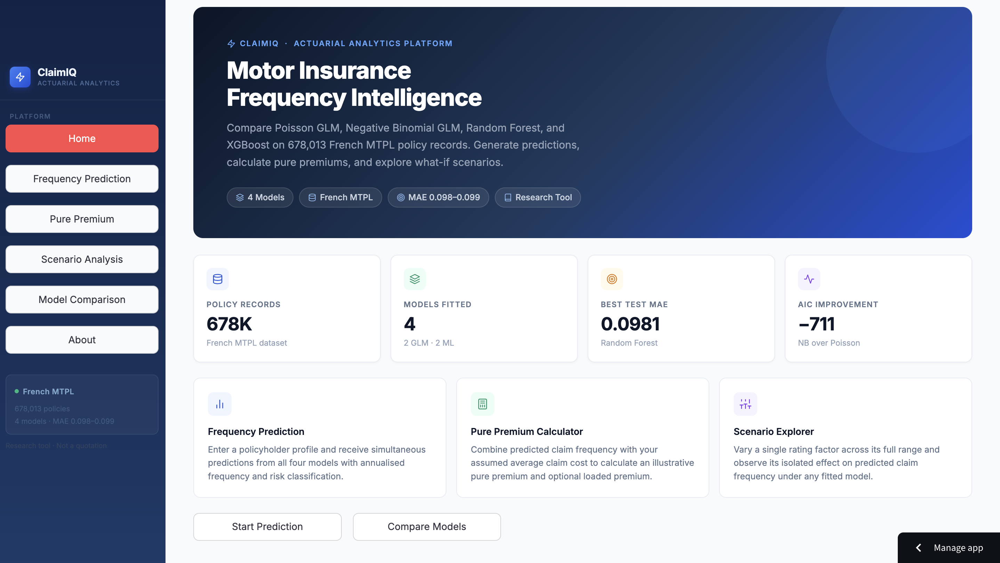

<h1 align="center">ClaimIQ</h1>

<p align="center">
Motor Insurance Claim Frequency & Pure Premium Simulator
</p>

<p align="center">
An actuarial decision-support application comparing classical statistical models and machine learning techniques for motor insurance claim frequency prediction.
</p>

<p align="center">
<a href="https://claimiq-app.streamlit.app">

</a>


</p>

<p align="center">
  
</p>

##  Live Demo

[](https://claimiq-app.streamlit.app)
##  Features

- Predict motor insurance claim frequency using four fitted models.
- Compare Poisson GLM, Negative Binomial GLM, Random Forest, and XGBoost.
- Estimate illustrative pure premiums.
- Explore what-if scenarios using interactive sliders.
- Compare model performance using MAE and AIC.
- View feature importance and GLM coefficients.
- Built with Streamlit for an intuitive web interface.

## Project Overview

ClaimIQ estimates expected motor insurance claim frequency from four fitted models:

| Model | Type | Test MAE | AIC |
|-------|------|----------|-----|
| Poisson GLM | Statistical | 0.09888 | 229,548.83 |
| Negative Binomial GLM | Statistical | 0.09945 | 228,837.56 |
| Random Forest | Machine Learning | 0.09809 | N/A |
| XGBoost | Machine Learning | 0.09821 | N/A |

Models are trained on the French Motor Third-Party Liability (MTPL) dataset
comprising 678,013 policy records.

---

## Project Structure

```
app.py                # Main Streamlit application
save_models.py        # Model training
models/               # Saved ML models
data/                 # Dataset & metrics
images/               # README screenshots
utils/                # Helper functions
```

## Installation

```bash
git clone https://github.com/Wafaa-ja/claimiq.git
cd claimiq
pip install -r requirements.txt
streamlit run app.py
```


---


---

## Application Pages

| Page | Description |
|------|-------------|
| Home | Overview and quick-start |
| Claim Frequency Prediction | Enter policyholder profile, get predictions from all four models |
| Pure Premium Calculator | Convert predicted frequency to an illustrative pure premium |
| Scenario Analysis | Vary one input and observe its effect on predicted frequency |
| Model Comparison | MAE table, AIC comparison, feature importance charts |
| About the Research | Dataset, methodology, findings, references, limitations |

---

---

## Technologies Used

| Category | Technologies |
|----------|--------------|
| Language | Python 3.13 |
| Web Framework | Streamlit |
| Machine Learning | Scikit-learn, XGBoost |
| Statistical Modeling | Statsmodels (Poisson GLM, Negative Binomial GLM) |
| Data Processing | Pandas, NumPy |
| Visualization | Plotly |

---

## Dataset

This project is based on the French Motor Third-Party Liability (MTPL) dataset containing approximately **678,000 insurance policies**.

The application predicts **annual claim frequency** using both classical actuarial models and modern machine learning methods.

**Input variables include:**

- Driver Age
- Vehicle Age
- Bonus-Malus
- Population Density
- Exposure

---

## Future Improvements

- Predict claim severity in addition to claim frequency.
- Implement SHAP values for model explainability.
- Support additional pricing models.
- Deploy with Docker and cloud infrastructure.
- Expand the simulator with more insurance datasets.

---

## Author

**Wafaa Jawad**

B.S. Actuarial Science  
King Fahd University of Petroleum and Minerals (KFUPM)

GitHub: https://github.com/Wafaa-ja